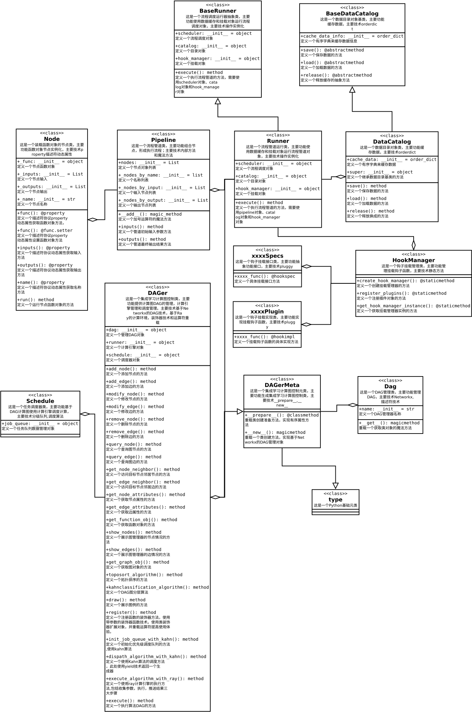

# SeaFlow工作流管理包设计

## 1.关键概念

+ Node
  + 可调用对象
  + 输入参数数据
  + 输出结果数据
  + 属性
+ Scheduler
  + Pipeline
    + 流程管道
    + 调度列表
  + DirectedAcyclicGraph
    + 流程图
    + 调度图
  + Runner
    + 执行器
    + 调度器
    + 数据目录
  + DataCatalog
    + 数据目录
    + 加载数据
    + 保存数据
  + Hook
    + 收集参数数据
    + 保存结果数据
  
## 2.功能设计

+ Node
  + 函数
  + 输入
  + 输出
  + 运行
+ Pipeline(Node)
  + 节点列表
  + 节点名称
  + 节点输入
  + 节点输出
  + \+运算符
+ DataCatalog
  + 数据缓存
  + 加载数据
  + 保存数据
+ DAG
  + DAG管理
  + 调度管理
  + DAG操作
+ Hook
  + 收集参数数据
  + 保存结果数据
+ Runner(Pipeline,DAG,Datacatalog,Hook)
  + 流程管道
  + 流程图
  + 数据目录
  + 执行
  
## 3.技术列表

+ @property
+ hook-pluggy
+ \_\_call\_\_
+ \_\_add\_\_
+ cache_dict
+ \_\_new\_\_
+ \_\_init\_\_
+ \_\_prepare\_\_
+ type元类
+ 描述符技术
+ Mixin
+ 装饰器技术
+ nametuple
+ networkx
+ inspect-signature
+ 运算符重载\_\_rshift\_\_
+ \_\_slots\_\_
+ \_\_get\_\_

## 4.UML

+ 总体结构UML图
